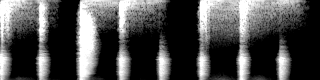

### Introduction 

This is the demo website for the ISMIR-21 submission, "A Benchmarking Initiative for Audio-domain Music Generation using the FreeSound Loop Dataset", which is now under review.

In this webpage, we provide audio examples of the one-bar drum loops (with 120 BPM) generated by different generative models, including UNAGAN, StyleGAN, and StyleGAN2.

We first show the result for the models trained on the drum-loop subset of the FreeSound Loop Dataset (i.e., the Freesound dataset).  Then, we show the result for the models trained on the larger, yet private, looperman dataset.

We also show the result when we use the style-mixing technique of StyleGAN2 to generate the "interpolated" version of a source loop and a target loop, in a "style transfer" like flavor.

### Demo audio

#### Models trained on the Freesound dataset 

* real data

    

        <audio src="demo_page/freesound/real_data/wav/18436_36084.wav" controls="" preload=""></audio>
    

    

        <audio src="demo_page/freesound/real_data/wav/20477_103296_3.wav" controls="" preload=""></audio>
    

    

        <audio src="demo_page/freesound/real_data/wav/21571_45941_11.wav" controls="" preload=""></audio>
    

 
* UNAGAN

    

        <audio src="demo_page/freesound/unagan/wav/1.wav" controls="" preload=""></audio>
    

    

        <audio src="demo_page/freesound/unagan/wav/2.wav" controls="" preload=""></audio>
    

    

        <audio src="demo_page/freesound/unagan/wav/3.wav" controls="" preload=""></audio>
    

* StyleGAN

    

        <audio src="demo_page/freesound/stylegan/wav/audio_1006.wav" controls="" preload=""></audio>
    

    

        <audio src="demo_page/freesound/stylegan/wav/audio_1007.wav" controls="" preload=""></audio>
    

    

        <audio src="demo_page/freesound/stylegan/wav/audio_1008.wav" controls="" preload=""></audio>
    

* StyleGAN2

    

        <audio src="demo_page/freesound/stylegan2/wav/1006.wav" controls="" preload=""></audio>
    

    

        <audio src="demo_page/freesound/stylegan2/wav/1007.wav" controls="" preload=""></audio>
    

    

        <audio src="demo_page/freesound/stylegan2/wav/1008.wav" controls="" preload=""></audio>
    

 
 

#### Interpolation result of the StyleGAN2 model trained on the Freesound dataset

StyleGAN and StyleGAN2 show fascinating results in their style mixing experiments. These models generate images from a coarse-to-fine manner,  and it appears that the early coarse-style blocks control more of the generation of high-level visual attributes, such as pose and hairstyle, while the later fine-style blocks control the generation of finer visual attributes such as color and lightning.  The style-mixing experiment shows that we can interchange the style codes to the coarse-style and fine-style blocks of two input images A and B, and create the interpolated version whose high-level features come from one of the input images and low-level features from the other.

Being inspired by this, we also conduct style-mixing using the StyleGAN2 model we trained. Specifically, we consider the first two blocks of our model as the coarse-style blocks, and the last two blocks as the fine-style blocks.  According to the interpolated result shown below, it seems the interpolated loop resembles the source audio in terms of timbre, and resembles the target audio in its rhythmic pattern.

| |source_1<audio src="demo_page/freesound/stylegan2_interpolation/source_0.wav" controls="" preload=""></audio>|source_2<audio src="demo_page/freesound/stylegan2_interpolation/source_1.wav" controls="" preload=""></audio>|source_3<audio src="demo_page/freesound/stylegan2_interpolation/source_2.wav" controls="" preload=""></audio>|source_4<audio src="demo_page/freesound/stylegan2_interpolation/source_3.wav" controls="" preload=""></audio>|source_5<audio src="demo_page/freesound/stylegan2_interpolation/source_4.wav" controls="" preload=""></audio>|
|target_1<audio src="demo_page/freesound/stylegan2_interpolation/target_0.wav" controls="" preload=""></audio>|<audio src="demo_page/freesound/stylegan2_interpolation/source_0_target_0.wav" controls="" preload=""></audio>|<audio src="demo_page/freesound/stylegan2_interpolation/source_1_target_0.wav" controls="" preload=""></audio>|<audio src="demo_page/freesound/stylegan2_interpolation/source_2_target_0.wav" controls="" preload=""></audio>|<audio src="demo_page/freesound/stylegan2_interpolation/source_3_target_0.wav" controls="" preload=""></audio>|<audio src="demo_page/freesound/stylegan2_interpolation/source_4_target_0.wav" controls="" preload=""></audio>|
|target_2<audio src="demo_page/freesound/stylegan2_interpolation/target_1.wav" controls="" preload=""></audio>|<audio src="demo_page/freesound/stylegan2_interpolation/source_0_target_1.wav" controls="" preload=""></audio>|<audio src="demo_page/freesound/stylegan2_interpolation/source_1_target_1.wav" controls="" preload=""></audio>|<audio src="demo_page/freesound/stylegan2_interpolation/source_2_target_1.wav" controls="" preload=""></audio>|<audio src="demo_page/freesound/stylegan2_interpolation/source_3_target_1.wav" controls="" preload=""></audio>|<audio src="demo_page/freesound/stylegan2_interpolation/source_4_target_1.wav" controls="" preload=""></audio>|
|target_3<audio src="demo_page/freesound/stylegan2_interpolation/target_2.wav" controls="" preload=""></audio>|<audio src="demo_page/freesound/stylegan2_interpolation/source_0_target_2.wav" controls="" preload=""></audio>|<audio src="demo_page/freesound/stylegan2_interpolation/source_1_target_2.wav" controls="" preload=""></audio>|<audio src="demo_page/freesound/stylegan2_interpolation/source_2_target_2.wav" controls="" preload=""></audio>|<audio src="demo_page/freesound/stylegan2_interpolation/source_3_target_2.wav" controls="" preload=""></audio>|<audio src="demo_page/freesound/stylegan2_interpolation/source_4_target_2.wav" controls="" preload=""></audio>|

 

#### Models trained on the Looperman dataset

* real data

    

        <audio src="demo_page/loooperman/real_data/wav/Zotiyac Type Drums_ShakotanZ_27th Oct 2018_130_Trap_Drum_Unknown_2.wav" controls="" preload=""></audio>
    

    

        <audio src="demo_page/loooperman/real_data/wav/Zotiyac Type Drums_ShakotanZ_27th Oct 2018_130_Trap_Drum_Unknown_4.wav" controls="" preload=""></audio>
    

    

        <audio src="demo_page/loooperman/real_data/wav/Zumde Beat_Fanto8BC_11th Mar 2018_90_Ambient_Drum_Unknown_1.wav" controls="" preload=""></audio>
    

* UNAGAN

    

        <audio src="demo_page/loooperman/unagan/wav/1.wav" controls="" preload=""></audio>
    

    

        <audio src="demo_page/loooperman/unagan/wav/2.wav" controls="" preload=""></audio>
    

    

       <audio src="demo_page/loooperman/unagan/wav/3.wav" controls="" preload=""></audio>
    

* StyleGAN

    

        <audio src="demo_page/loooperman/stylegan/wav/audio_1006.wav" controls="" preload=""></audio>
    

    

        <audio src="demo_page/loooperman/stylegan/wav/audio_1007.wav" controls="" preload=""></audio>
    

    

        <audio src="demo_page/loooperman/stylegan/wav/audio_1008.wav" controls="" preload=""></audio>
    

* StyleGAN2

    

        <audio src="demo_page/loooperman/stylegan2/wav/9.wav" controls="" preload=""></audio>
    

    

        <audio src="demo_page/loooperman/stylegan2/wav/15.wav" controls="" preload=""></audio>
    

    

        <audio src="demo_page/loooperman/stylegan2/wav/40.wav" controls="" preload=""></audio>
    

* StyleGAN2_four_bar

    

        <audio src="demo_page/loooperman/stylegan2_four_bar/wav/1.wav" controls="" preload=""></audio>
    

    

        <audio src="demo_page/loooperman/stylegan2_four_bar/wav/2.wav" controls="" preload=""></audio>
    

    

        <audio src="demo_page/loooperman/stylegan2_four_bar/wav/3.wav" controls="" preload=""></audio>
    

 

#### Interpolation result of the StyleGAN2 model trained on the Looperman dataset with one bar 

 

| |source_1<audio src="demo_page/loooperman/stylegan2_interpolation/source_0.wav" controls="" preload=""></audio>|source_2<audio src="demo_page/loooperman/stylegan2_interpolation/source_1.wav" controls="" preload=""></audio>|source_3<audio src="demo_page/loooperman/stylegan2_interpolation/source_2.wav" controls="" preload=""></audio>|source_4<audio src="demo_page/loooperman/stylegan2_interpolation/source_3.wav" controls="" preload=""></audio>|source_5<audio src="demo_page/loooperman/stylegan2_interpolation/source_4.wav" controls="" preload=""></audio>|
|target_1<audio src="demo_page/loooperman/stylegan2_interpolation/target_0.wav" controls="" preload=""></audio>|<audio src="demo_page/loooperman/stylegan2_interpolation/source_0_target_0.wav" controls="" preload=""></audio>|<audio src="demo_page/loooperman/stylegan2_interpolation/source_1_target_0.wav" controls="" preload=""></audio>|<audio src="demo_page/loooperman/stylegan2_interpolation/source_2_target_0.wav" controls="" preload=""></audio>|<audio src="demo_page/loooperman/stylegan2_interpolation/source_3_target_0.wav" controls="" preload=""></audio>|<audio src="demo_page/loooperman/stylegan2_interpolation/source_4_target_0.wav" controls="" preload=""></audio>|
|target_2<audio src="demo_page/loooperman/stylegan2_interpolation/target_1.wav" controls="" preload=""></audio>|<audio src="demo_page/loooperman/stylegan2_interpolation/source_0_target_1.wav" controls="" preload=""></audio>|<audio src="demo_page/loooperman/stylegan2_interpolation/source_1_target_1.wav" controls="" preload=""></audio>|<audio src="demo_page/loooperman/stylegan2_interpolation/source_2_target_1.wav" controls="" preload=""></audio>|<audio src="demo_page/loooperman/stylegan2_interpolation/source_3_target_1.wav" controls="" preload=""></audio>|<audio src="demo_page/loooperman/stylegan2_interpolation/source_4_target_1.wav" controls="" preload=""></audio>|
|target_3<audio src="demo_page/loooperman/stylegan2_interpolation/target_2.wav" controls="" preload=""></audio>|<audio src="demo_page/loooperman/stylegan2_interpolation/source_0_target_2.wav" controls="" preload=""></audio>|<audio src="demo_page/loooperman/stylegan2_interpolation/source_1_target_2.wav" controls="" preload=""></audio>|<audio src="demo_page/loooperman/stylegan2_interpolation/source_2_target_2.wav" controls="" preload=""></audio>|<audio src="demo_page/loooperman/stylegan2_interpolation/source_3_target_2.wav" controls="" preload=""></audio>|<audio src="demo_page/loooperman/stylegan2_interpolation/source_4_target_2.wav" controls="" preload=""></audio>|

 
 

#### Interpolation result of the StyleGAN2 model trained on the Looperman dataset with four bar 

 

| |source_1<audio src="demo_page/loooperman/stylegan2_interpolation_four_bar/source_0.wav" controls="" preload=""></audio>|source_2<audio src="demo_page/loooperman/stylegan2_interpolation_four_bar/source_1.wav" controls="" preload=""></audio>|source_3<audio src="demo_page/loooperman/stylegan2_interpolation_four_bar/source_2.wav" controls="" preload=""></
|target_1<audio src="demo_page/loooperman/stylegan2_interpolation_four_bar/target_0.wav" controls="" preload=""></audio>|<audio src="demo_page/loooperman/stylegan2_interpolation_four_bar/source_0_target_0.wav" controls="" preload=""></audio>|<audio src="demo_page/loooperman/stylegan2_interpolation_four_bar/source_1_target_0.wav" controls="" preload=""></audio>|<audio src="demo_page/loooperman/stylegan2_interpolation_four_bar/source_2_target_0.wav" controls="" preload=""></audio>|
|target_2<audio src="demo_page/loooperman/stylegan2_interpolation_four_bar/target_1.wav" controls="" preload=""></audio>|<audio src="demo_page/loooperman/stylegan2_interpolation_four_bar/source_0_target_1.wav" controls="" preload=""></audio>|<audio src="demo_page/loooperman/stylegan2_interpolation_four_bar/source_1_target_1.wav" controls="" preload=""></audio>|<audio src="demo_page/loooperman/stylegan2_interpolation_four_bar/source_2_target_1.wav" controls="" preload=""></audio>|
|target_3<audio src="demo_page/loooperman/stylegan2_interpolation_four_bar/target_2.wav" controls="" preload=""></audio>|<audio src="demo_page/loooperman/stylegan2_interpolation_four_bar/source_0_target_2.wav" controls="" preload=""></audio>|<audio src="demo_page/loooperman/stylegan2_interpolation_four_bar/source_1_target_2.wav" controls="" preload=""></audio>|<audio src="demo_page/loooperman/stylegan2_interpolation_four_bar/source_2_target_2.wav" controls="" preload=""></audio>|